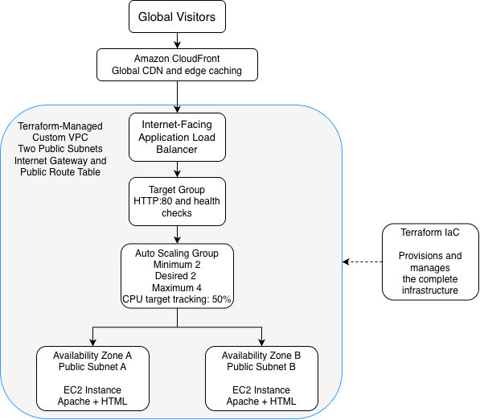
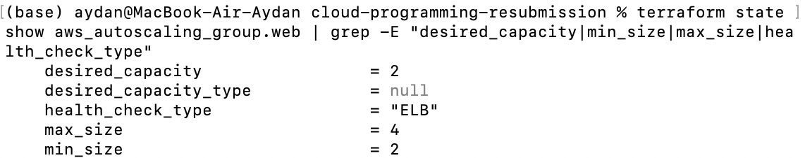
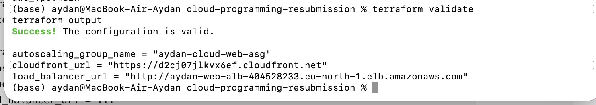
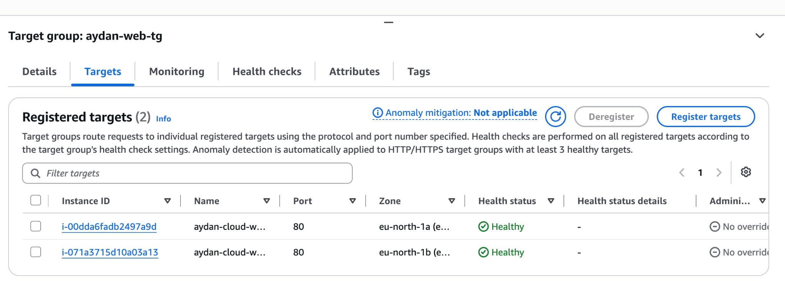
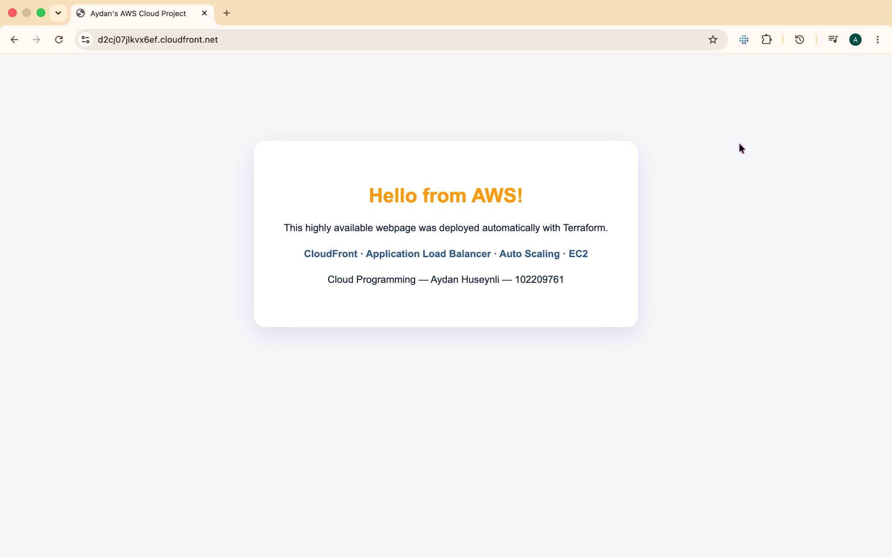

# Highly Available AWS Web Architecture with Terraform

This project deploys a simple webpage on AWS using Terraform as Infrastructure as Code. The implementation provides high availability across two Availability Zones, global content delivery through Amazon CloudFront and automatic backend scaling based on CPU utilisation.

The project was developed for the IU Cloud Programming module.

## Architecture



Request flow:

`Global visitor → Amazon CloudFront → Application Load Balancer → Target Group → Auto Scaling Group → EC2 instances`

Terraform creates and manages the complete infrastructure, including the custom network.

## Project Requirements

| Requirement | Implemented solution |
|---|---|
| High availability | Two EC2 instances distributed across two Availability Zones |
| Global low latency | Amazon CloudFront edge delivery and caching |
| Scalable backend | Auto Scaling Group with CPU target tracking |
| Infrastructure as Code | Modular Terraform configuration |
| Automated webpage deployment | Apache and HTML installed through a user-data script |

## AWS Resources

- Custom VPC
- Internet Gateway and public route table
- Two public subnets across separate Availability Zones
- Application Load Balancer
- Target group with HTTP health checks
- EC2 launch template
- Auto Scaling Group
- CPU target-tracking policy
- Amazon CloudFront distribution
- Dedicated security groups

## Auto Scaling Configuration

The Auto Scaling Group uses the following capacity settings:

- Minimum capacity: `2`
- Desired capacity: `2`
- Maximum capacity: `4`
- Health-check type: `ELB`
- CPU target: `50%`



## Project Structure

| File | Purpose |
|---|---|
| `versions.tf` | Defines the required Terraform and AWS provider versions |
| `providers.tf` | Configures the AWS provider, region and resource tags |
| `variables.tf` | Defines configurable project values |
| `data.tf` | Retrieves available zones and the latest Amazon Linux AMI |
| `networking.tf` | Creates the VPC, subnets, Internet Gateway and public routing |
| `security.tf` | Defines security groups for the load balancer and web servers |
| `load-balancer.tf` | Creates the ALB, target group and listener |
| `compute.tf` | Creates the launch template, Auto Scaling Group and scaling policy |
| `cloudfront.tf` | Creates the CloudFront distribution |
| `outputs.tf` | Returns the website, load-balancer and Auto Scaling outputs |
| `user-data.sh` | Installs Apache and creates the HTML webpage |
| `terraform.tfvars.example` | Provides an example variables file |
| `DEPLOYMENT_EVIDENCE.md` | Documents implementation and verification evidence |

## Prerequisites

- Terraform `1.5` or newer
- AWS CLI
- An authenticated AWS CLI profile
- AWS permissions for VPC, EC2, ELB, Auto Scaling, CloudWatch and CloudFront

The default configuration uses:

- AWS region: `eu-north-1`
- AWS CLI profile: `aydan-cloud`

These values can be changed through Terraform variables.

## Deployment

```bash
terraform init
terraform fmt -check
terraform validate
terraform plan -out=tfplan
terraform apply tfplan
```

Terraform outputs the CloudFront URL, Application Load Balancer URL and Auto Scaling Group name after deployment.

## Deployment Verification

### Terraform validation and outputs

The Terraform configuration validated successfully and returned the deployed resource endpoints.



### Load-balancer health checks

The target group registered two EC2 instances in separate Availability Zones. Both targets passed the Application Load Balancer health checks.



### CloudFront website delivery

The final webpage was delivered successfully through the CloudFront HTTPS endpoint.



## Security

- EC2 instances accept HTTP traffic only from the Application Load Balancer security group.
- Terraform state files, plan files and local provider data are excluded through `.gitignore`.
- AWS credentials and private keys are not stored in this repository.
- CloudFront redirects viewers to HTTPS.

## Clean Up

To prevent ongoing AWS charges after assessment and verification:

```bash
terraform destroy
```

---

## Author

Aydan Huseynli

This project was created for the DLBSEPCP01_E – Cloud Programming module at IU International University of Applied Sciences.
